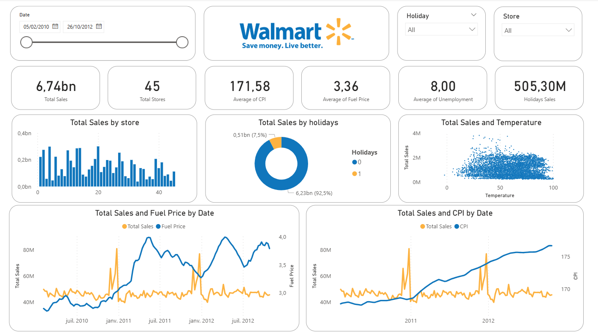

# 🛒 Walmart Sales Analysis — Power BI Dashboard


## 📊 Project Overview
 
This project is an end-to-end **sales analysis dashboard** built with **Power BI**, using real Walmart store data covering **45 stores** over a period from **February 2010 to October 2012**.
 
The goal was to explore the impact of external factors — holidays, fuel prices, temperature, CPI, and unemployment on weekly sales performance, and to surface actionable insights through an interactive dashboard.

---

## 🖼️ Dashboard Preview
 


---
 
## 🎯 Key KPIs
 
| Metric | Value |
|---|---|
| 💰 Total Sales | **6.74 Billion** |
| 🏪 Total Stores | **45** |
| 📈 Average CPI | **171.58** |
| ⛽ Average Fuel Price | **$3.36** |
| 👷 Average Unemployment Rate | **8.00%** |
| 🎉 Holiday Sales | **505.30 Million** |
 
---

## 📁 Dataset
 
**Source:** [Walmart Dataset — Kaggle](https://www.kaggle.com/datasets/yasserh/walmart-dataset)  
**File:** `Walmart_Dataset.csv`
 
### Columns Description
 
| Column | Description |
|---|---|
| `Store` | Store ID (1 to 45) |
| `Date` | The week of sales |
| `Weekly_Sales` | Sales for the given store |
| `Holiday_Flag` | Whether the week is a special holiday week — `1` = Holiday week / `0` = Non-holiday week |
| `Temperature` | Temperature on the day of sale |
| `Fuel_Price` | Cost of fuel in the region |
| `CPI` | Prevailing Consumer Price Index |
| `Unemployment` | Prevailing unemployment rate |
 
### 🎉 Holiday Events
 
| Holiday | Dates |
|---|---|
| 🏈 Super Bowl | Feb 12, 2010 — Feb 11, 2011 — Feb 10, 2012 — Feb 8, 2013 |
| 👷 Labour Day | Sep 10, 2010 — Sep 9, 2011 — Sep 7, 2012 — Sep 6, 2013 |
| 🦃 Thanksgiving | Nov 26, 2010 — Nov 25, 2011 — Nov 23, 2012 — Nov 29, 2013 |
| 🎄 Christmas | Dec 31, 2010 — Dec 30, 2011 — Dec 28, 2012 — Dec 27, 2013 |
 
---

---
 
## 📈 Dashboard Visuals
 
### 🃏 KPI Cards
Headline metrics displayed at the top: Total Sales, Total Stores, Average CPI, Average Fuel Price, Average Unemployment Rate, and Holiday Sales.
 
### 🏪 Total Sales by Store
Bar chart showing weekly sales distribution across all 45 stores identifies top-performing and underperforming stores at a glance.
 
### 🎉 Total Sales by Holidays
Donut chart comparing holiday vs. non-holiday sales:
- **92.5%** of total sales occur during **non-holiday** weeks
- **7.5%** during **holiday weeks** — with concentrated sales spikes around Super Bowl, Thanksgiving and Christmas
### 🌡️ Total Sales and Temperature
Scatter plot revealing the relationship between temperature and weekly sales — mild temperatures (50–75°F) tend to correlate with higher sales volumes.
 
### ⛽ Total Sales and Fuel Price by Date
Dual-axis line chart tracking weekly sales alongside fuel price trends — highlights how fuel price fluctuations correlate with sales peaks and dips over 2010–2012.
 
### 📊 Total Sales and CPI by Date
Dual-axis line chart showing how rising CPI (inflation) relates to sales behavior the steady CPI increase from 2010 to 2012 reflects inflationary pressure, yet sales remained relatively stable.
 
---
 
## 🔍 Key Insights
 
- **Holiday spikes are concentrated** — holiday weeks (7.5% of total) generate significant sales peaks, especially around Thanksgiving and Christmas.
- **Fuel price sensitivity** — periods with fuel prices above $3.80 tend to coincide with slight sales dips, suggesting an impact on consumer purchasing power.
- **Consumer resilience** — despite steady CPI growth from 2010 to 2012, overall sales remained stable, indicating that Walmart's value positioning held strong during inflationary periods.
- **Store performance gap** — significant variance between top stores (0.35bn+) and bottom stores (below 0.05bn), revealing opportunities for operational benchmarking.

- ## 📂 Project Structure
 
```
📦 Walmart-PowerBI-Dashboard
 ┣ 📊 Walmart_Dashboard.pbix    # Power BI project file
 ┣ 📄 Walmart_Dataset.csv       # Source dataset
 ┣ 🖼️ Walmart_Dashboard.png     # Dashboard screenshot
 ┣ 🖼️ Walmart_logo.png          # Walmart logo used in the report
 ┗ 📝 README.md                 # Project documentation
```
